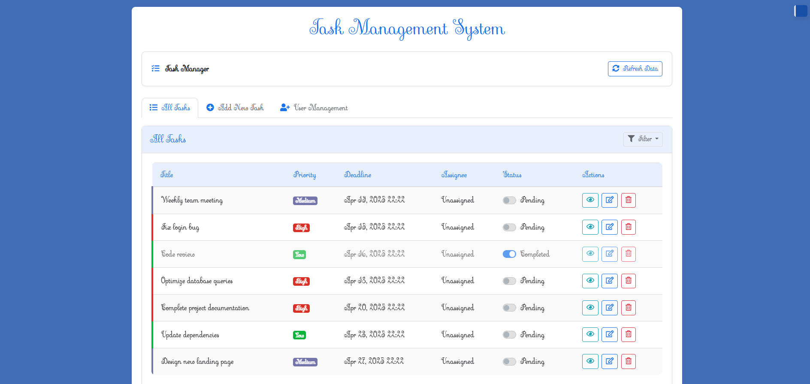
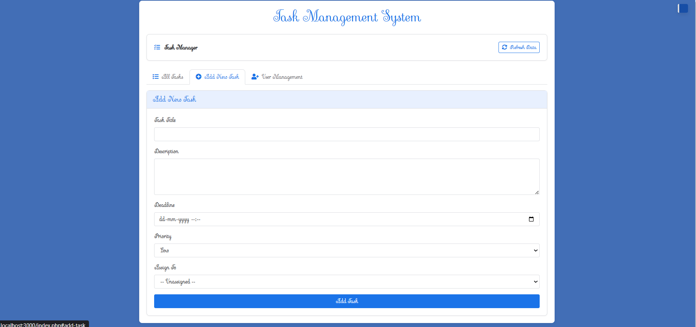
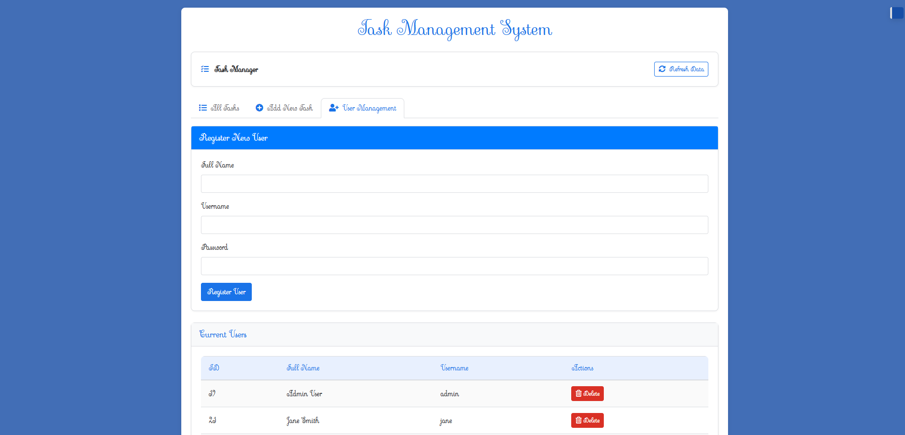
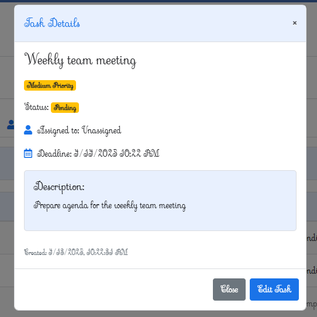
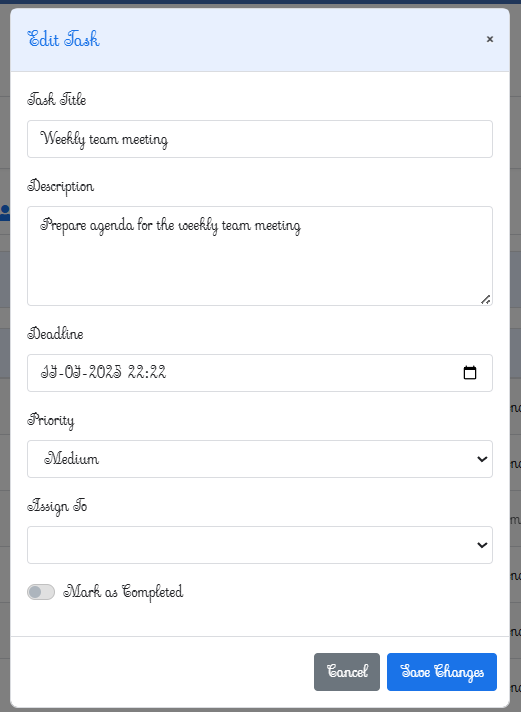

# Task Management System

A comprehensive web-based application designed to help teams organize, track, and manage tasks efficiently. Built with PHP and MySQL, this system provides a robust solution for task creation, assignment, prioritization, and monitoring.

## 🌟 Features

### Task Management
- **Create Tasks**: Add new tasks with title, description, deadline, priority, and assignee
- **Update Tasks**: Edit existing task details as needed
- **Delete Tasks**: Remove tasks that are no longer needed
- **Task Status**: Mark tasks as completed or pending using toggle switches
- **Task Filtering**: Filter tasks by status (completed/pending) and priority (high/medium/low)
- **Task Prioritization**: Assign priorities (high, medium, low) with color-coded indicators
- **Task Assignment**: Assign tasks to specific users from the registered user list
- **Detailed Task View**: View comprehensive task information in modal dialogs

### User Management
- **User Registration**: Register new users with full name, username, and password
- **User Deletion**: Remove users from the system (with validation to prevent deletion of users with assigned tasks)
- **User Listing**: View all registered users in a tabular format

### User Interface
- **Tabbed Interface**: Separate tabs for viewing tasks, adding tasks, and managing users
- **Responsive Design**: Bootstrap-based responsive layout for various screen sizes
- **Visual Priority Indicators**: Color-coded badges for task priorities
- **Task Status Styling**: Visual differentiation between completed and pending tasks
- **Modal Dialogs**: Task details, editing, and user deletion confirmation via modal dialogs
- **Notification System**: User feedback on operations via notification area
- **Data Refresh**: Manual refresh button to update displayed data

## 🛠️ Technology Stack

- **Backend**: PHP 7.4+
- **Database**: MySQL 5.7+
- **Frontend**: HTML5, CSS3, JavaScript, jQuery
- **UI Framework**: Bootstrap 5
- **Icons**: Font Awesome
- **API Format**: JSON
- **Authentication**: Password hashing with bcrypt

## 📂 Directory Structure

```
/
├── api.php                 # Main API router
├── api_handler.php         # Process API requests
├── config.php              # Configuration settings
├── db_connection.php       # Database connection setup
├── index.php               # Main entry point
├── process.php             # Request processor
├── controllers/
│   ├── TaskController.php  # Task API controller
│   └── UserController.php  # User API controller
├── css/
│   ├── style.css           # Main stylesheet
│   └── style.min.css       # Minified CSS styles
├── database/
│   └── task_management.sql     # Database schema
├── function/
│   ├── task_functions.php  # Task business logic
│   └── user_functions.php  # User business logic
├── html/
│   ├── add_task_tab.php    # Add task tab template
│   ├── all_tasks_tab.php   # All tasks listing tab template
│   ├── footer.php          # Footer template with script loading
│   ├── header.php          # Header template with CSS loading
│   ├── modals.php          # Modal dialog templates
│   ├── navigation.php      # Tab navigation structure
│   └── user_management_tab.php # User management tab template
├── js/
│   ├── main.js             # Application initialization
│   ├── notifications.js    # Notification system
│   ├── task-filters.js     # Task filtering functionality
│   ├── task-manager.js     # Task CRUD operations
│   ├── user-delete.js      # User deletion handling
│   ├── user-manager.js     # User management operations
│   └── utils.js            # Common utility functions
└── utils/
    └── ApiUtils.php        # API utilities
```

## 💾 Database Design

The system uses a MySQL database with two main tables:

### Users Table
```sql
CREATE TABLE IF NOT EXISTS users (
    user_id INT AUTO_INCREMENT PRIMARY KEY,
    username VARCHAR(50) NOT NULL UNIQUE,
    password VARCHAR(255) NOT NULL,
    full_name VARCHAR(100) NOT NULL,
    created_at TIMESTAMP DEFAULT CURRENT_TIMESTAMP
);
```

### Tasks Table
```sql
CREATE TABLE IF NOT EXISTS tasks (
    task_id INT AUTO_INCREMENT PRIMARY KEY,
    title VARCHAR(255) NOT NULL,
    description TEXT,
    deadline DATETIME DEFAULT NULL,
    priority ENUM('low','medium','high') DEFAULT 'low',
    assignee_id INT DEFAULT NULL,
    completed TINYINT(1) DEFAULT 0,
    created_at DATETIME DEFAULT CURRENT_TIMESTAMP,
    updated_at DATETIME DEFAULT NULL,
    FOREIGN KEY (assignee_id) REFERENCES users(user_id) ON DELETE SET NULL
);
```

## 🚀 Installation Guide

### System Requirements
- PHP 7.4 or higher
- MySQL 5.7 or higher
- Web server (Apache/Nginx)
- Modern browser with JavaScript enabled

### Installation Steps
1. Clone the repository to your web server directory
2. Create a MySQL database named `task_management`
3. Import the `database/task_management.sql` file to set up the database schema
4. Configure database connection in `db_connection.php`
5. Ensure proper file permissions for the web server
6. Access the application through your web browser

### Recommended Server Configuration
- Enable PHP error logging
- Set appropriate memory limits
- Configure database connection pooling for performance
- Enable HTTP caching for static assets

## 🔌 API Endpoints

### Task Endpoints
- `GET /api.php?endpoint=tasks`: Get all tasks
- `GET /api.php?endpoint=task&id={id}`: Get a specific task
- `POST /api.php?endpoint=tasks`: Create a new task
- `PUT /api.php?endpoint=task&id={id}`: Update a task
- `PUT /api.php?endpoint=task-status&id={id}`: Update task status
- `DELETE /api.php?endpoint=task&id={id}`: Delete a task

### User Endpoints
- `GET /api.php?endpoint=users`: Get all users
- `POST /api.php?endpoint=users`: Create a new user
- `DELETE /api.php?endpoint=user&id={id}`: Delete a user

## 🔄 API Response Formats

### Success Response Format
```json
{
    "success": true,
    "message": "Operation completed successfully",
    "data": { ... }
}
```

### Error Response Format
```json
{
    "success": false,
    "error": "Error message details"
}
```

## Screenshots







## ✨ Future Enhancements

### Short-Term (1-2 Weeks)
- Code optimization
- Enhance client-side validation
- Basic task search capability
- UI improvements

### Medium-Term (3-4 Weeks)
- Authentication system with login and session management
- Task comments functionality
- Data export (CSV)
- Enhanced user profiles

### Long-Term (2-3 Months)
- Statistical dashboard with task metrics
- Role-based access control
- Email notifications for assignments and deadlines
- File attachments for tasks
- Comprehensive RESTful API for external integration

## 🛡️ Security Features

- Password hashing using bcrypt
- Server-side input validation
- SQL injection prevention via prepared statements
- Comprehensive error handling

## 📊 JavaScript Module Structure

The application uses a modular JavaScript architecture with clear separation of concerns:

### Core Modules
- `main.js`: Initializes all modules and sets up global event handlers
- `utils.js`: Provides utility functions for date formatting and styling
- `notifications.js`: Manages toast notification display

### Feature Modules
- `task-manager.js`: Handles task CRUD operations and UI updates
- `task-filters.js`: Implements filtering logic for tasks
- `user-manager.js`: Manages user registration and listing
- `user-delete.js`: Specialized handling for user deletion with confirmation

## 📝 Contributing

Contributions to improve the Task Management System are welcome. Please follow these steps:

1. Fork the repository
2. Create a feature branch (`git checkout -b feature/amazing-feature`)
3. Commit your changes (`git commit -m 'Add some amazing feature'`)
4. Push to the branch (`git push origin feature/amazing-feature`)
5. Open a Pull Request

## 📄 License

This project is open-sourced under the [MIT License](LICENSE).

## 👥 Authors

- Kynsai Kharsyntiew

## 🙏 Acknowledgments

- Bootstrap team for the amazing UI framework
- jQuery team for simplifying JavaScript interactions
- All contributors who have helped shape this project
